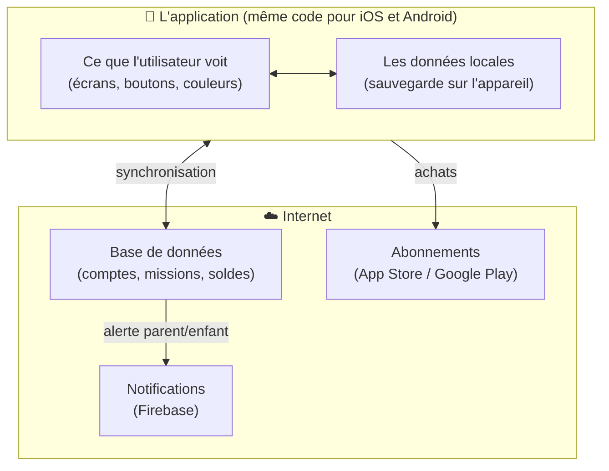
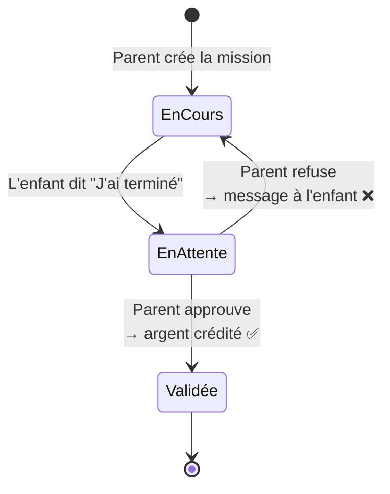
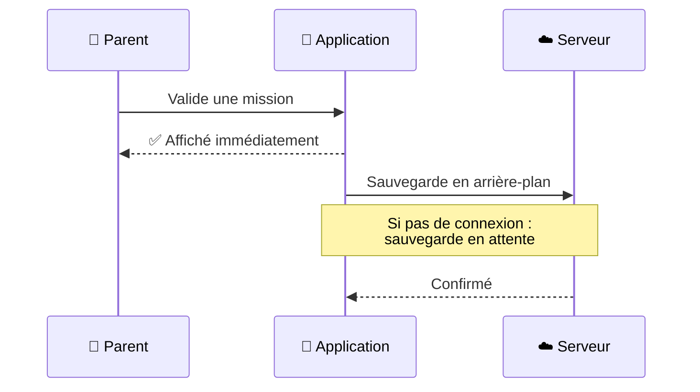
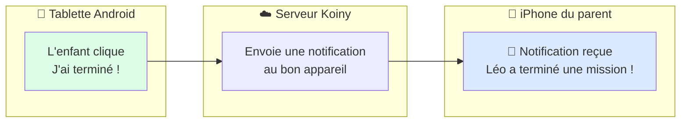
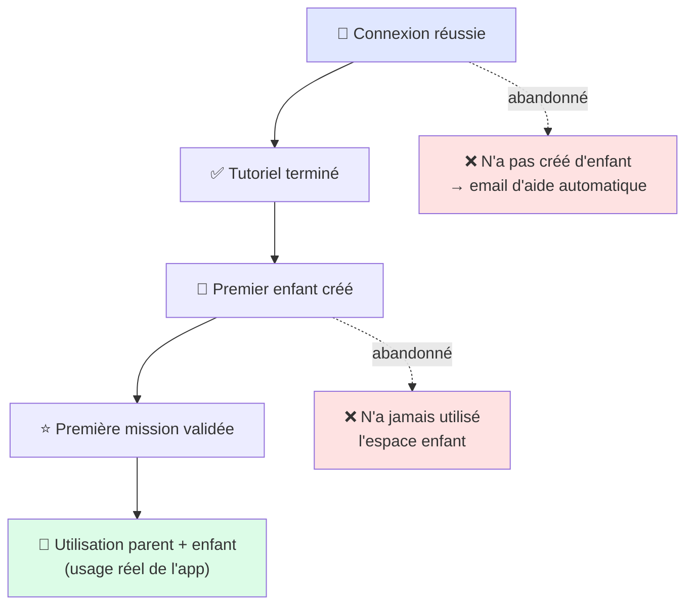

# Comment j'ai créé Koiny avec l'aide de l'IA

> **Ce document explique la démarche** que j'ai suivie pour créer Koiny
> de A à Z en utilisant l'intelligence artificielle comme assistant de développement.
> Il montre concrètement les questions posées à l'IA, les problèmes rencontrés,
> et comment ils ont été résolus.
>
> **Koiny en résumé** : une application mobile iOS et Android qui aide les parents
> à gérer l'argent de poche de leurs enfants (6–14 ans) à travers des missions,
> des objectifs d'épargne et un suivi en temps réel.

---

## Comment ça fonctionne : l'IA comme co-développeur

Je n'ai pas simplement demandé à l'IA "crée mon app". La vraie méthode, c'est un dialogue continu :

```
┌─────────────────────────────────────────────┐
│  1. Je décris ce que je veux en français    │
│  2. L'IA crée ou modifie le code           │
│  3. Je teste sur mon téléphone              │
│  4. Je décris le problème à l'IA           │
│  5. L'IA corrige → retour à l'étape 3      │
└─────────────────────────────────────────────┘
```

**L'outil utilisé** : Claude Code (Anthropic) — un assistant IA intégré
directement dans l'éditeur de code, qui voit tous les fichiers du projet
et maintient le contexte entre les sessions.

---

## Étape 1 — Définir l'idée et choisir les outils

### Ce que j'ai demandé à l'IA

```
Je veux créer une application mobile pour aider les parents à gérer
l'argent de poche de leurs enfants de 6 à 14 ans.

Concept :
- Le parent crée des "missions" (ranger la chambre, faire la vaisselle)
  avec une récompense en argent
- L'enfant accomplit la tâche et la soumet pour validation
- Le parent approuve → l'argent est crédité sur le solde virtuel
- L'enfant peut définir des objectifs d'épargne (ex: un jouet)

Contraintes :
- Une seule app qui fonctionne sur iPhone ET Android
- Fonctionne même sans connexion internet
- Données sauvegardées dans le cloud
- Version gratuite (1 enfant) + version payante (illimité)

Propose-moi les meilleurs outils pour construire ça.
```

### Ce que l'IA a proposé et pourquoi

| Outil | À quoi ça sert |
|---|---|
| **React + TypeScript** | Le "moteur" de l'app — un seul langage pour tout |
| **Capacitor** | Ce qui transforme l'app web en vraie app iPhone/Android |
| **Supabase** | La base de données en ligne (les comptes, les soldes, les missions) |
| **RevenueCat** | Gestion des abonnements payants (App Store + Google Play) |
| **Tailwind CSS** | Le "styliste" — gère l'apparence visuelle |

### Comment l'app est structurée



---

## Étape 2 — Créer les "briques" de base

### La structure des données

Avant de faire quoi que ce soit de visible, j'ai demandé à l'IA de définir
exactement ce que l'app allait stocker.

```
Définis la structure des informations de mon app :

- Une Mission : un nom, une récompense en euros, une icône, un état
  (en cours / soumise / validée)
- Un Objectif : un nom, un montant à atteindre, une icône
- Un Enfant : prénom, avatar, couleur, solde, ses missions, son historique
- Un Compte parent : ses enfants, ses préférences (langue, devise, son)

Règles importantes :
- Le solde maximum est de 100€ (sécurité pour les enfants)
- Il faut supporter l'euro, le dollar, la livre sterling, et 20 autres devises
- Tout doit être en français, néerlandais et anglais
```

---

## Étape 3 — La connexion et les comptes

### Ce que j'ai demandé

```
Crée l'écran de connexion. Je veux :
- Connexion avec Google (bouton Google)
- Connexion avec Apple (iPhone uniquement — cacher le bouton sur Android)
- Connexion par email (l'app envoie un lien cliquable par mail, pas de mot
  de passe à retenir)

Important sur téléphone : quand quelqu'un clique sur le lien email,
il faut que ça ouvre directement l'app Koiny, pas le navigateur web.
```

### Problème rencontré et correction

```
Bug : sur Android, quand le bouton Google échouait, le système de secours
envoyait l'utilisateur vers la page web de Koiny au lieu de revenir dans l'app.

Corrige pour que le secours ouvre le navigateur mais revienne automatiquement
dans l'app après la connexion Google, comme sur iPhone.
```

---

## Étape 4 — L'espace parent

### Ce que j'ai demandé

```
Crée le tableau de bord du parent. Ce qu'il doit voir :

En haut : les avatars de ses enfants avec un badge rouge qui indique
combien de missions attendent d'être validées pour chaque enfant.

La carte principale (aux couleurs de l'enfant sélectionné) :
- Photo de l'enfant + prénom + âge
- Le solde en gros
- Ce qu'il a gagné / dépensé / reçu comme amendes cette semaine
- Deux boutons : Ajouter de l'argent / Retirer de l'argent

En dessous : les objectifs d'épargne avec une barre de progression
(rouge au début, orange, puis vert quand c'est atteint)

Puis : les missions en cours et celles qui attendent validation.
```

### Adaptation pour Android

```
L'espace parent sur Android doit avoir un look différent de l'iPhone —
plus dans le style des apps Android (Google, Gmail). Crée une version
Android avec 4 onglets en bas : Tableau de bord, Demandes, Historique,
Profil. Garde exactement la même logique, juste l'apparence qui change.
```

---

## Étape 5 — L'espace enfant

### Ce que j'ai demandé

```
Crée l'espace de l'enfant. Lui il voit :
- Son solde et son avatar
- Sa tirelire (l'objectif en cours avec la barre de progression)
- Ses missions actives avec un bouton "J'ai terminé !"
- Un bouton pour demander un nouvel objectif ou une nouvelle mission
- Ses gains récents

Règles importantes :
- L'enfant ne peut JAMAIS modifier son propre solde
- Quand une mission est validée, déclencher des confettis à l'écran
- Si l'enfant a reçu une pénalité, lui montrer une alerte — mais une
  seule fois, ne pas la réafficher à chaque ouverture
```

---

## Étape 6 — Les missions

### Ce que j'ai demandé

```
Programme le fonctionnement complet des missions :

1. Le parent crée une mission pour son enfant
2. L'enfant voit la mission et clique "J'ai terminé"
3. Le parent reçoit une notification et peut valider ou refuser
4. Si validé → l'argent est ajouté au solde de l'enfant
5. Si refusé → le parent peut laisser un commentaire à l'enfant

Règle : l'opération doit être instantanée visuellement — l'écran se met
à jour immédiatement sans attendre internet. Si le téléphone est hors ligne,
les données se synchronisent quand la connexion revient.
```

### Le flux d'une mission



### Problème rencontré

```
Bug important : les missions créées par le parent n'apparaissaient pas
chez l'enfant. Et les demandes de l'enfant disparaissaient quelques
secondes après avoir été envoyées.

Diagnostique et corrige ce problème de synchronisation.
```

L'IA a trouvé la cause : un verrou interne restait bloqué et empêchait
la sauvegarde de se déclencher. Correction appliquée dans tout le projet.

---

## Étape 7 — L'épargne et les objectifs

### Ce que j'ai demandé

```
Ajoute le système d'objectifs d'épargne.

Un objectif c'est : un nom (ex: "Lego Technic"), un prix à atteindre (35€),
une icône.

La barre de progression change de couleur selon l'avancement :
- Rouge si moins du tiers atteint
- Orange à mi-chemin
- Vert quand c'est presque là
- Or quand c'est atteint

Quand le solde couvre le prix → bouton "Acheter" pour le parent,
qui débite le solde et marque l'objectif comme obtenu.

En version gratuite : 1 seul objectif par enfant.
En version premium : illimité.
```

---

## Étape 8 — Fonctionner sans internet

### Le principe expliqué par l'IA

```
Explique-moi et implémente le principe "l'interface répond immédiatement,
la sauvegarde cloud suit derrière".

Quand le parent valide une mission :
1. L'écran se met à jour IMMÉDIATEMENT (l'utilisateur ne attend rien)
2. La sauvegarde en ligne se fait EN ARRIÈRE-PLAN
3. Si internet est coupé, les données restent sur l'appareil
4. Quand la connexion revient, tout se synchronise automatiquement

Il ne faut jamais que deux appareils écrasent les données l'un de l'autre.
```

### Comment ça marche en pratique



---

## Étape 9 — Sécurité du code PIN parent

### Ce que j'ai demandé

```
Le parent peut protéger son espace avec un code PIN à 4 chiffres.

Exigences de sécurité :
- Le PIN ne doit JAMAIS être stocké tel quel — même moi je ne dois pas
  pouvoir le lire en base de données
- Utilise la technique la plus sécurisée disponible pour le chiffrer
- Si le parent oublie son PIN : envoyer un lien par email qui permet de
  le réinitialiser directement depuis l'app

L'écran de saisie du PIN doit avoir des états visuels clairs :
"en train de vérifier", "code correct", "code incorrect" — sans
clignotement bizarre entre les états.
```

### Flux "code oublié"

```
Le parent clique "Code oublié ?" → l'app efface le PIN → envoie un email
avec un lien → le parent clique le lien sur son téléphone → l'app s'ouvre
directement sans demander de PIN → le parent en crée un nouveau.
```

---

## Étape 10 — Le modèle payant

### Ce que j'ai demandé

```
Intègre le système d'abonnement payant avec RevenueCat.

Deux offres :
- Mensuel : 1,99€/mois (avec 14 jours d'essai gratuit)
- Annuel : 16,99€/an (économies 30%)

Ce qui est limité en version gratuite :
- Maximum 1 enfant
- Maximum 2 missions actives par enfant
- Maximum 1 objectif d'épargne
- Pas de statistiques

Version premium : tout illimité.

L'abonnement doit fonctionner aussi bien sur iPhone (App Store) que sur
Android (Google Play) — avec la bonne facture selon l'appareil.
```

### Problème rencontré sur Android

```
Bug : après un achat sur Android, l'app ne passait pas en premium
immédiatement — il fallait fermer et relancer l'app.

Cause trouvée et corrigée : Google Play envoie un identifiant de produit
légèrement différent d'Apple (avec un suffixe supplémentaire), ce que
l'app ne reconnaissait pas.
```

---

## Étape 11 — Trois langues

### Ce que j'ai demandé

```
L'app doit être entièrement disponible en français, néerlandais et anglais.
Je vise la Belgique principalement.

Règle absolue : chaque nouveau texte ajouté dans l'app doit exister dans
les 3 langues. Si j'oublie une traduction, rappelle-le moi.

La langue est choisie dans les paramètres et se synchronise sur tous les
appareils du même compte.
```

---

## Étape 12 — Notifications entre appareils

### Ce que j'ai demandé

```
Je veux que le parent soit notifié sur son iPhone quand son enfant termine
une mission sur sa tablette Android — et vice versa.

Les notifications importantes :
- L'enfant a terminé une mission → notifie le parent
- Le parent a validé / refusé une mission → notifie l'enfant
- L'enfant demande un nouvel objectif ou une mission → notifie le parent
```

### Comment ça marche



---

## Étape 13 — L'apparence Android

### Ce que j'ai demandé

```
Sur Android, les apps ont un style visuel différent d'iPhone — plus de
coins arrondis, boutons texte, menus qui glissent depuis le bas.

Crée une version Android de tous mes écrans qui respecte ce style Android,
sans toucher au design iPhone qui reste intact.

Les deux versions doivent avoir exactement les mêmes fonctionnalités —
seule l'apparence change.
```

---

## Étape 14 — Mettre l'app sur les stores

### Ce que j'ai demandé

```
Documente toutes les étapes pour publier l'app sur l'App Store d'Apple
et le Google Play Store.

Pour Apple : comment créer l'archive, soumettre pour validation,
gérer les retours d'Apple.

Pour Android : comment créer le fichier de déploiement, configurer
les abonnements dans Google Play, les étapes de test obligatoires
(12 testeurs pendant 14 jours avant d'avoir accès à la production).
```

---

## Étape 15 — Emails automatiques

### Ce que j'ai demandé

```
Crée des emails automatiques envoyés aux utilisateurs inactifs :
- Après 7 jours sans connexion : email de rappel
- Après 2 jours sans avoir créé d'enfant : email d'aide à la configuration
- Après 30 jours : email de re-engagement

Les emails doivent être dans la langue du compte (FR/NL/EN) et ne jamais
être envoyés deux fois à la même personne.
```

---

## Étape 16 — Le widget écran d'accueil (iPhone)

### Ce que j'ai demandé

```
Crée un widget pour l'écran d'accueil de l'iPhone qui affiche le solde
de l'enfant.

Le widget change de couleur selon la situation :
- Orange : des missions attendent d'être validées
- Vert : l'enfant a gagné de l'argent aujourd'hui
- Rouge : l'enfant n'a pas été actif depuis 3 jours
- Violet par défaut

Le widget doit afficher un message en français, néerlandais ou anglais
selon la langue du compte.
```

### Problème rencontré

```
Bug : le widget affichait 0.00€ pour tout le monde.

La cause : quand l'app transmettait les données au widget, elle les
reformatait et perdait des informations en chemin.

Corrige pour que les données soient transmises directement au widget
sans transformation.
```

---

## Étape 17 — Mesurer l'utilisation

### Ce que j'ai demandé

```
Ajoute un système de mesure pour comprendre comment les gens utilisent l'app :
- Combien s'inscrivent
- Combien créent leur premier enfant
- Combien utilisent vraiment l'app (basculent entre l'espace parent et enfant)
- Sur quel type d'appareil (iPhone ou Android)

Ces données me permettront d'améliorer l'app là où les gens abandonnent.
```

### Le funnel mesuré



---

## Ce que cette méthode m'a appris

### Les 5 clés d'un bon développement avec l'IA

**1. Décrire le "quoi" et le "pourquoi", pas le "comment"**

> ❌ « Mets un try/catch autour de la ligne 47 »
> ✅ « La mission disparaît après avoir été soumise par l'enfant — trouve pourquoi et corrige »

L'IA comprend le problème métier et choisit la meilleure solution technique.

**2. Tester sur de vrais appareils**

Les bugs les plus importants n'apparaissent que sur un vrai téléphone :
connexion lente, vieux Android, comportement du clavier, notifications…
Pas sur un simulateur.

**3. Garder une "mémoire de projet"**

Un fichier `CLAUDE.md` à la racine du projet contient toutes les règles,
décisions et historique. L'IA le lit à chaque session — pas besoin de
tout ré-expliquer.

**4. Itérer sur des problèmes précis**

Chaque bug rapporté à l'IA était accompagné de :
- Ce qui devrait se passer
- Ce qui se passe en réalité
- Sur quel appareil

**5. L'IA comme expert technique, moi comme chef de produit**

Je décidais *quoi* construire et *pour qui*. L'IA décidait *comment*
le construire de façon robuste et sécurisée.

---

## Résultat final

| | |
|---|---|
| **Plateformes** | iPhone (App Store ✅ publiée) + Android (Play Store en test) |
| **Langues** | Français · Néerlandais · Anglais |
| **Fonctionnalités** | Missions · Objectifs · Solde · PIN sécurisé · Widget iOS · Notifications push · Abonnement premium |
| **Durée de développement** | Mars → Juin 2026 |
| **Utilisateurs actifs** | 20+ utilisateurs réels, testeurs en Belgique, France, Royaume-Uni |

---

*Document rédigé pour illustrer une démarche de développement d'application mobile
assisté par intelligence artificielle — de l'idée initiale jusqu'à la publication sur les stores.*
