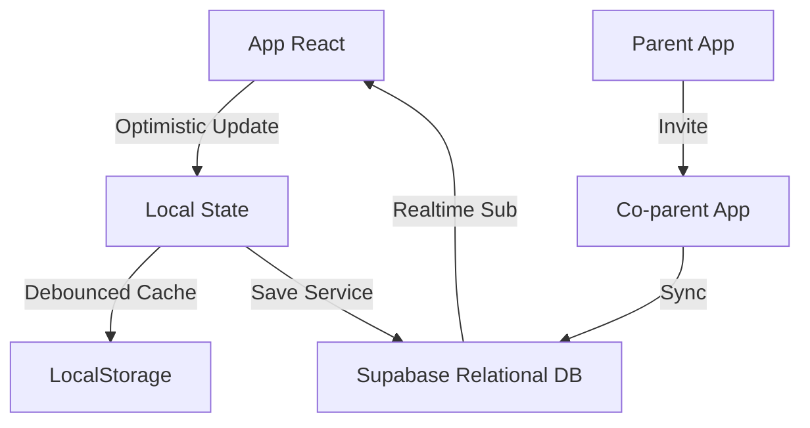

# 💰 Koiny - L'éducation financière simplifiée pour les familles

<div align="center">
  
  <p><em>Donnez à vos enfants les clés d'une gestion financière responsable par le jeu et l'effort.</em></p>
  
  [](https://vitejs.dev/)
  [](https://reactjs.org/)
  [](https://capacitorjs.com/)
  [](https://supabase.io/)
</div>

---

## 📖 Présentation

**Koiny** est une application mobile et web conçue pour aider les parents à enseigner la valeur de l'argent à leurs enfants. Contrairement aux applications bancaires traditionnelles, Koiny repose sur une approche **éducative et gamifiée** utilisant de l'argent virtuel indexé sur des efforts réels (missions).

### Problème
Les enfants d'aujourd'hui ont du mal à visualiser l'argent numérique. Les parents manquent d'outils pour structurer l'argent de poche de manière équitable et transparente.

### Solution
Une interface miroir (Parent/Enfant) où chaque gain est le résultat d'une mission accomplie, favorisant ainsi la psychologie de l'effort et de l'épargne.

---

## 🌟 Fonctionnalités Clés

### 👨‍👩‍👧‍👦 Pour les Parents (Administrateurs)
- **Tableau de bord multi-enfants** : Vue d'ensemble des soldes et activités.
- **Gestion des missions** : Création de défis personnalisés (ex: "Ranger sa chambre", "Avoir une bonne note") avec récompenses.
- **Validation avec preuve** : Système d'approbation/rejet des missions terminées avec possibilité de feedback.
- **Co-parentalité** : Invitez un autre parent à gérer la famille en temps réel.
- **Contrôle du solde** : Possibilité de faire des transactions manuelles (bonus/malus).
- **Sécurité par PIN & Biométrie** : Accès à l'interface parent protégé par un code PIN sécurisé et possibilité d'utiliser **Face ID / Touch ID**.

### 👶 Pour les Enfants (Utilisateurs)
- **Profils personnalisés** : Thèmes de couleurs et avatars uniques choisis par l'enfant.
- **Banque virtuelle** : Suivi du solde et historique des gains.
- **Objectifs d'épargne** : Création d'objectifs (ex: "Nouveau vélo") avec barre de progression dynamique.
- **Demandes actives** : Possibilité de solliciter une mission ou un cadeau auprès des parents.
- **Animations gratifiantes** : Système de confettis et retours haptiques lors des gains.

---

## 🏗️ Architecture Technique

### Vue d'ensemble du flux de données


### Schéma de données (V2)
Le projet utilise un schéma relationnel robuste sur Supabase :

- **`families`** : Regroupe les membres et centralise le code d'invitation.
- **`profiles`** : Profils utilisateurs (Auth Google) avec rôle (parent/coparent) et PIN.
- **`children`** : Profils des enfants liés à une famille avec thème et balance.
- **`missions`** : Catalogue des défis (disponibles, en attente, validés).
- **`goals`** : Objectifs d'épargne spécifiques à chaque enfant.
- **`transactions`** : Historique complet et immuable des flux financiers.

---

## 🛠️ Stack Technologique

| Couche | Technologie |
|---|---|
| **Frontend** | React 18, TypeScript, Tailwind CSS |
| **Build Tool** | Vite.js |
| **Mobile Runtime** | Capacitor (iOS/Android native support) |
| **Backend / DB** | Supabase (PostgreSQL, Auth, Realtime) |
| **Plugins Natifs** | Capacitor (Local Notifications, Apple Sign-In, Preferences) |
| **Charts** | Recharts (Visualisation des tendances) |
| **Design** | Headless UI, FontAwesome, Google Fonts, Tailwind CSS v3 |

---

## 🚀 Installation et Démarrage

### Prérequis
- [Node.js](https://nodejs.org/) (v18+)
- [npm](https://www.npmjs.com/)
- [Xcode](https://developer.apple.com/xcode/) (pour le développement iOS sur Mac)

### 1. Cloner et Installer
```bash
git clone https://github.com/votre-repo/koiny.git
cd koiny
npm install
```

### 2. Configuration Supabase
Copiez le fichier `.env.example` en `.env` et remplissez vos clés :
```env
VITE_SUPABASE_URL=votre_url_supabase
VITE_SUPABASE_ANON_KEY=votre_cle_anon
```

### 3. Développement Web
```bash
npm run dev
```

### 4. Déploiement iOS (Capacitor)
```bash
# Générer le build web
npm run build

# Synchroniser avec le projet natif
npx cap sync ios

# Ouvrir dans Xcode
npx cap open ios
```

---

## 🔒 Sécurité et Confidentialité

- **Authentification forte** : Intégration de Google OAuth et **Apple Sign-In** pour une connexion simplifiée et sécurisée sur tous les appareils.
- **Code PIN et Biométrie local-first** : Le PIN parent est stocké de manière sécurisée. Les parents peuvent aussi utiliser **Face ID / Touch ID** pour réinitialiser le code PIN de manière ultra-sécurisée.
- **Mode Démo** : Un mode hors-connexion permet aux familles de tester l'application avant de créer un compte (données volatiles).
- **RGPD Ready** : Les données sont structurées de manière à permettre l'export ou la suppression totale d'un compte et de ses données liées (via RPC Postgres).
- **Isolation des familles** : Utilisation intensive des **Row Level Security (RLS)** sur Supabase pour garantir qu'une famille ne peut jamais voir les données d'une autre.

---

## 📐 Structure du Projet

```text
Koiny/
├── App.tsx              # Cœur de l'application (Main Logic & Routing)
├── components/          # Composants UI (ParentView, ChildView, etc.)
├── services/            # Logique métier (Supabase, Notifications, Storage)
├── i18n.ts             # Service de traduction multilingue (FR / EN / NL)
├── types.ts            # Définition des interfaces TypeScript
├── ios/                 # Projet natif Xcode (Capacitor)
└── public/              # Assets et mascottes
```

---

## 🤝 Contribution

1. Formez le projet.
2. Créez votre branche (`git checkout -b feature/AmazingFeature`).
3. Commitez vos changements (`git commit -m 'Add some AmazingFeature'`).
4. Pushez sur la branche (`git push origin feature/AmazingFeature`).
5. Ouvrez une Pull Request.

---

## 📄 Licence

Distribué sous la licence **MIT**. Voir `LICENSE` pour plus d'informations.

---

<div align="center">
  <p>Fait avec ❤️ par l'équipe Koiny</p>
  <p><em>"L'argent ne pousse pas sur les arbres, il se mérite sur Koiny."</em></p>
</div>
