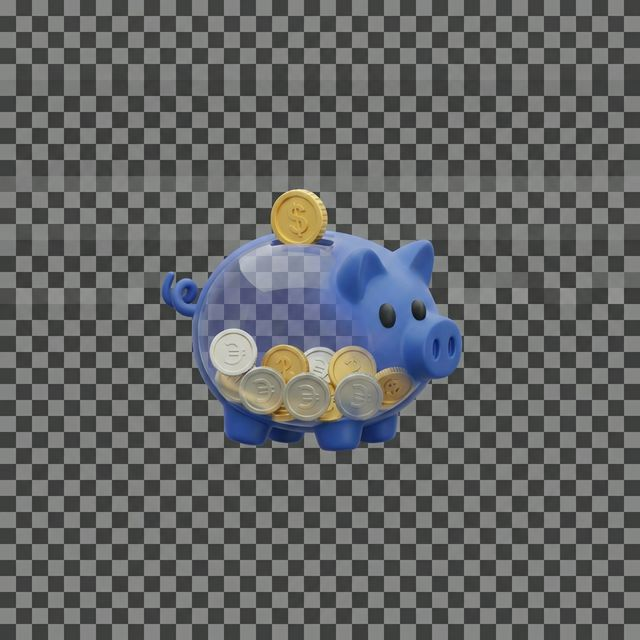

# 🎨 Guide d'utilisation des Assets Koiny

## 📦 Fichiers disponibles

### Logos & Icônes
| Fichier | Taille | Usage | Transparent |
|---------|--------|-------|-------------|
| **logo.png** | 1.0 MB | Logo mascot (grand format) | ✅ Oui |
| **mascot.png** | 44 KB | Mascot optimisé pour web | ✅ Oui |
| **favicon.png** | 60 KB | Icône navigateur (favicon) | ✅ Oui |

---

## 🎯 Utilisation dans AppScreens

### 1️⃣ Logo pour Header/Navbar
**Recommandation:** Utilise **`mascot.png`** (44KB)
- Parfait pour navbar, menus
- Déjà optimisé
- Fond transparent

```html

```

### 2️⃣ Logo pour sections Hero/Grande taille
**Recommandation:** Utilise **`logo.png`** (1.0MB)
- Meilleure qualité pour grands formats
- Fond transparent
- Utilise sur AppScreens pour sections principales

### 3️⃣ Favicon (Onglet navigateur)
**Recommandation:** **`favicon.png`** (60KB)
- Déjà configuré dans `<head>`
- Ne change pas

---

## 🖼️ Variantes pour AppScreens

### Logo sur fond blanc
```
Utilise: mascot.png ou logo.png directement
Background: #FFFFFF
Padding: 20px
```

### Logo sur fond couleur (Indigo/Violet)
```
Utilise: mascot.png ou logo.png
Background: #4F46E5 (Indigo)
Padding: 20px
Blend Mode: Normal
```

### Logo sur fond dark
```
Utilise: mascot.png ou logo.png
Background: #0F172A (Dark slate)
Padding: 20px
Blend Mode: Normal
```

---

## ✅ Checklist avant App Store

- [x] Logo transparent (mascot.png)
- [x] Logo haute qualité (logo.png)
- [x] Favicon (favicon.png)
- [ ] **Créer une version SVG** (optionnel, pour scalabilité infinie)
- [ ] **Créer des variantes 2x/3x** (pour retina displays)

---

## 💡 Recommandations pour AppScreens

### Export recommandé:
1. **Mascot PNG**
   - Size: 512x512px (pour 1x)
   - Utilisation: Navbar, small sections

2. **Logo PNG**
   - Size: 1024x1024px (pour 1x)
   - Utilisation: Hero, landing page

3. **Pour Retina (2x)**
   - Exporter à 1024x1024 pour mascot (2x de 512)
   - Exporter à 2048x2048 pour logo (2x de 1024)

---

## 🚀 Prêt pour AppScreens?

✅ Les images sont prêtes à être importées dans AppScreens:
1. Ouvre AppScreens
2. Ajoute les images dans ta project
3. Utilise `mascot.png` pour les petits éléments
4. Utilise `logo.png` pour les grands éléments
5. Configure le fond transparent ou ajuste l'arrière-plan selon ton besoin

---

**Note:** Les images sont en format PNG avec transparence. Parfait pour tous les fonds! 🎉
